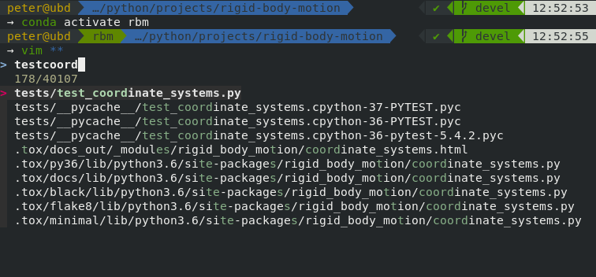

# my-zsh-prompt

A beautiful zsh prompt with tons of useful features.

Includes:
* Plugin management with [antigen](https://github.com/zsh-users/antigen)
* Theme by [powerlevel10k](https://github.com/romkatv/powerlevel10k)
* Fuzzy path completion and history search with [fzf](https://github.com/junegunn/fzf)
* Automatic command suggestions via [zsh-autosuggestions](https://github.com/zsh-users/zsh-autosuggestions)
* Syntax highlighting via [zsh-syntax-highlighting](https://github.com/zsh-users/zsh-syntax-highlighting)
* and more

## Installation

Install `zsh` using your systems package manager, e.g. on ubuntu/Debian:

    $ sudo apt-get install zsh

Clone the repository and run the setup script:

    $ git clone https://github.com/phausamann/my-zsh-prompt
    $ zsh my-zsh-prompt/setup.sh
    
For the status bar theme to display properly, you might need to install a font such as [FiraCode](https://github.com/tonsky/FiraCode).

## Usage

From your current shell, run:

    $ zsh

If you like what you see, you can make zsh your default shell:

    $ chsh -s $(which zsh)

The change will take effect on the next login.

## Keyboard shortcuts

* `CTRL+T` for fuzzy path completion (If you have part of the path already typed, type `**` and hit `Tab`)
* `CTRL+R` for fuzzy history search
* `CTRL+Space` for completing auto suggestions
* `CTRL+Left/Right` for completing auto suggestions word by word

## Customization

Edit `~/.zshrc` to customize the prompt and features.

